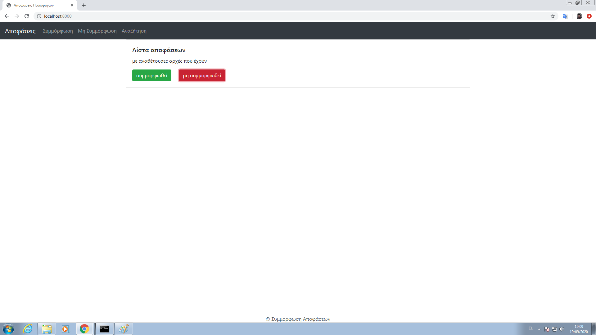
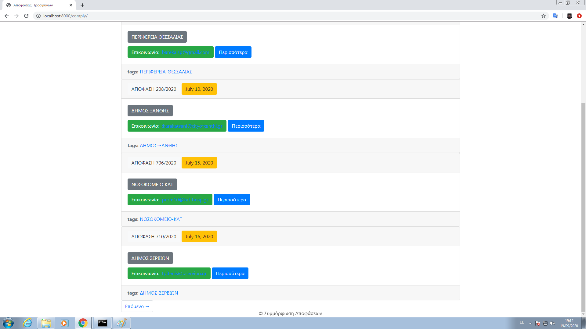
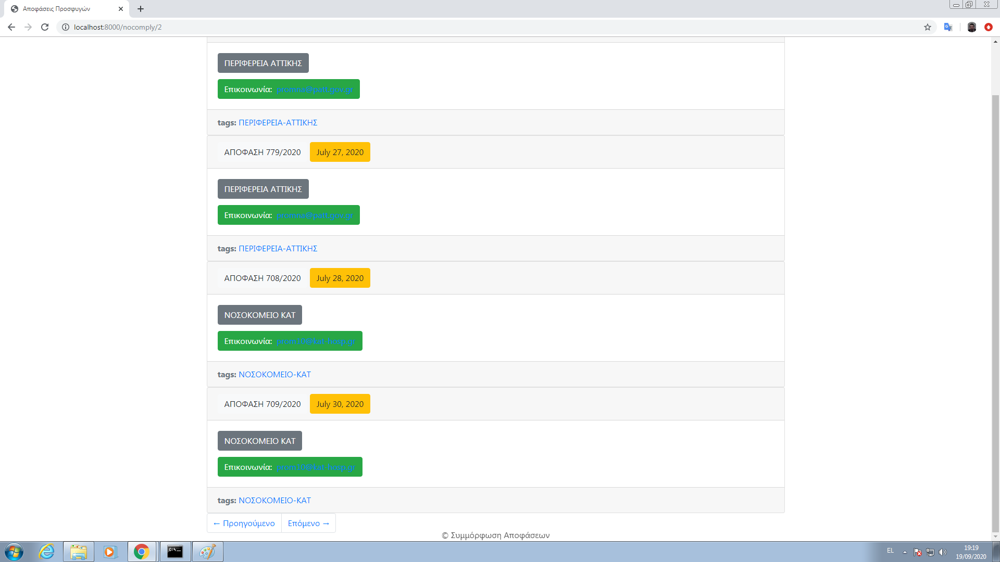
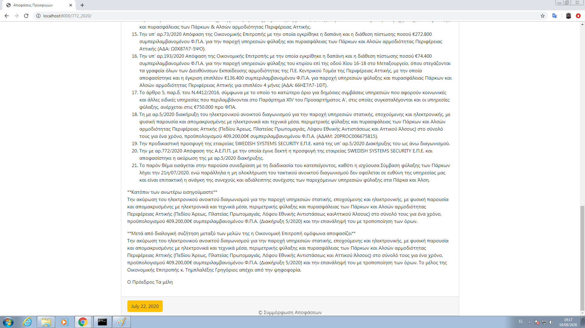
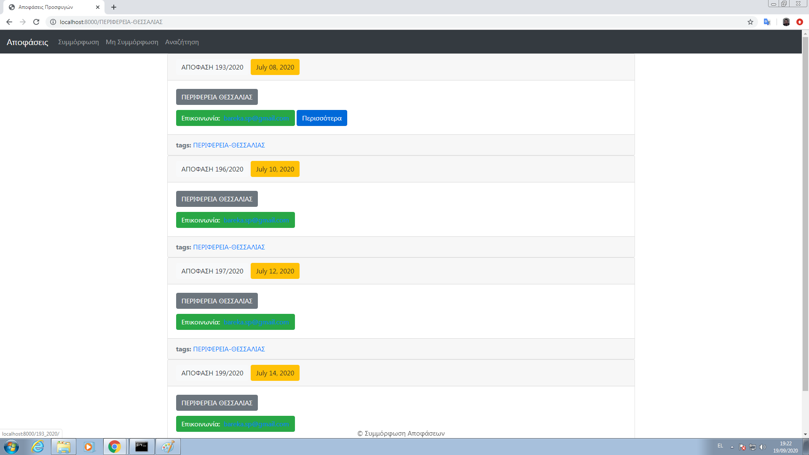
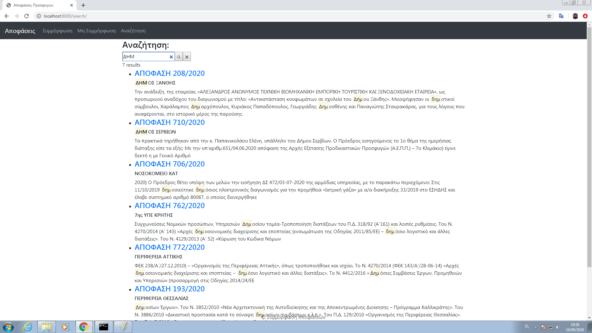
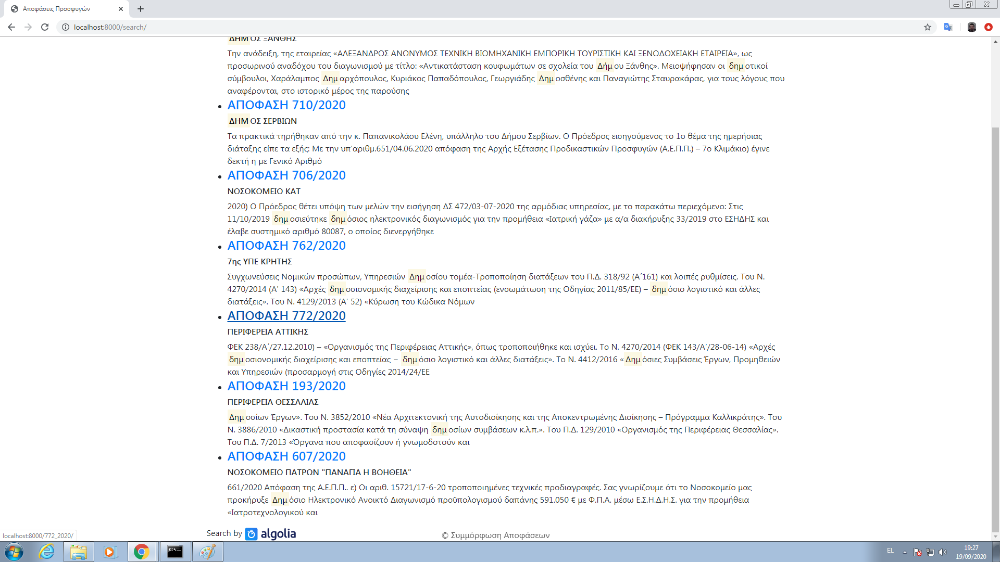

                                             Pre-judicial Compliance Blog

A Web blog where the user is able to get valuable information about several pre-judicial compliances of public procurement organizers regarding specific rejected judgements for them. Each rejected judgement belongs either to compliance or non compliance status, as long as the public procurement organizer has submitted or not the required law documents, where both of them are accessible via specific menus.

Regarding compliance status, the user has got the option to acquire more additional information for the specific rejected judgement such as the required law document for compliance, email and submission date of public procurement organizer accessible via specific link "More". For non compliance status, there is no such option for more additional information.

Additionally the user has also the ability to view in a blog-listed post specific rejected judgments that belong either to compliance or non compliance status for each specific public procurement organizer via specific tag (taxonomy) link. A search bar [powered by Algolia](https://www.algolia.com/) is added into the blog in order to find results for both compliance and non compliance status rejected judgements via specific keywords regarding these pre-judicial judgements.

[Algolia account](https://www.algolia.com/users/sign_up) should be created beforehand and the appropriate API keys need to be stored in gatsbyjs-config file for successful and powerful keyword search.

This app has been made via [React Bootstrap](https://react-bootstrap.github.io/), [Markdown](https://www.markdownguide.org/), [Gatsbyjs](https://www.gatsbyjs.com/) and also [Nodejs](https://nodejs.org/en/) for its successful operation and installation of additional required [gatsbyjs plugins](https://www.gatsbyjs.com/plugins).

**General view**

**Category view** *(compliance - non compliance status)*

**Specific view**

**Taxonomy view**

**Search view**

